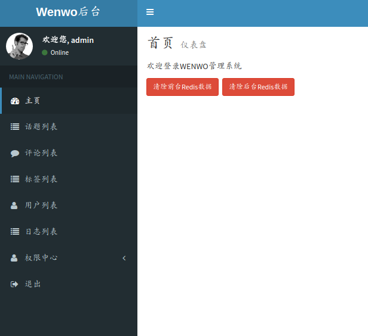

类似知乎的交流平台，在线[访问](http://web.julyerr.club:8080/)

#### 部分前端界面

#### 部分后台管理界面

### 项目使用技术
- spring-boot、spring-jpa、freemarker
- redis、MySQL

### 项目特色
- 邮件验证登入、github第三方登入
- 用户session存储在redis统一管理
- 常见交流平台的功能，文章发表、点踩、收藏以及消息通知等
- 前台基于声望的权限控制(有一定的权限才能对文章点赞、删帖等操作)
- 独立的后台管理界面，基于角色、资源进行权限管理（简易版RBAC系统）
- 支持七牛云文件上传等

### 快速开始

1. 安装和配置好mysql（为支持moji，需配置utf8mb4字符集）、redis
2. 在mysql中创建对应的数据库(默认wenwo)，springjpa启动的时候会自动创建对应的表，需要手动导入项目init.sql初始化数据
3. 前台访问`http://domain:8080`，后台管理访问`http://domain:8080/admin/login`(账号密码：admin/123，可以通过test下的文件运行生成bcrypt加密密码）
4. 可针对application.yaml进行配置，如七牛云文件上传、github第三方登入\网站cookie等信息

### 打包部署开发环境

- `mvn package`打包工程
- 执行部署 `nohup java -jar package.jar --spring.profiles.active=prod > wenwo.log 2>&1 &`

### 感谢

项目架构、前端界面主要参考以下github项目(前端技术较弱...)

- https://github.com/fanchaoo/hahu
- https://github.com/jiangwanwan/nowcoder
- https://github.com/ChinaLHR/JavaQuarkBBS

### License

MIT

